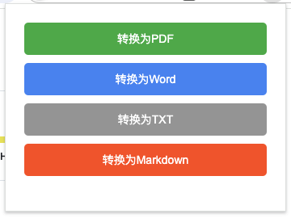

# Web to Document Converter Chrome 插件

## 项目简介
这是一个Chrome浏览器插件，可以将网页内容转换为PDF、Word等格式的文档。


## 功能特点

- 支持将网页转换为PDF、Word、TXT、Markdown格式
- 界面简洁美观
- 操作便捷

## 使用方法

1. 点击Chrome工具栏中的插件图标
2. 在弹出的界面中选择要转换的格式（PDF、Word、TXT、Markdown）
3. 等待转换完成，文件将自动下载到您的默认下载目录
注意⚠️：若是已经打开过的页面，需要重新刷新下页面

## 直接使用
1. 从GitHub Release下载资源包：
   - 访问项目的[GitHub Release页面](https://github.com/chuxiaoguo/web-to-document-chrome-plugin/releases)
   - 选择需要的版本（例如：v1.0.5）
   - 下载对应版本的zip资源包（web-to-docs-v1.0.5.zip）
   - 解压文件

2. 在Chrome浏览器中加载插件：
   - 打开Chrome浏览器，进入扩展程序页面（chrome://extensions/）
   - 开启右上角的"开发者模式"
   - 点击"加载已解压的扩展程序"
   - 选择release资源包解压后的文件夹
  
## 自行编译

### 环境要求

- Node.js (推荐 v14 或更高版本)
- npm 或 yarn 包管理器
- Chrome 浏览器

### 开发环境配置

1. 克隆项目到本地：
```bash
git clone git@github.com:chuxiaoguo/web-to-document-chrome-plugin.git
cd web-to-pdf-chrome-plugin
```

2. 安装依赖：
```bash
npm install
# 或者使用 yarn
yarn install
```

### 开发流程

1. 启动开发模式（支持实时构建）：
```bash
npm run watch
# 或者使用 yarn
yarn watch
```

### 打包发布

1. 构建生产版本：
```bash
npm run build
# 或者使用 yarn
yarn build
```

### 项目结构

```
├── content.js      # 注入到网页的内容脚本
├── icons/          # 插件图标
├── lib/            # 第三方库
├── manifest.json   # 插件配置文件
├── popup.html      # 弹出窗口HTML
├── popup.js        # 弹出窗口逻辑
├── release/        # 发布的资源包
└── vite.config.js  # Vite配置文件
```

### 技术栈

- Vite - 构建工具
- html2pdf.js - PDF转换库
- html-docx-js - Word文档转换库

## 注意事项

- 确保在开发时运行 `npm run watch` 或 `yarn watch` 以启用实时构建
- 首次加载或更新插件后可能需要刷新目标网页才能生效
- 转换大型网页时可能需要等待较长时间，请耐心等待
- 某些网站可能会限制内容访问或脚本执行，可能会影响转换效果

## 常见问题

1. 插件图标显示但无法点击？
   - 检查是否已经正确安装插件
   - 尝试重新加载插件
   - 确认当前网页是否支持插件运行

2. 转换后的PDF文件不完整？
   - 确保网页已完全加载
   - 检查网页是否包含动态加载的内容
   - 尝试等待几秒钟再进行转换

## 贡献指南

欢迎提交问题报告和功能建议！如果您想贡献代码，请：

1. Fork 项目
2. 创建您的特性分支 (`git checkout -b feature/AmazingFeature`)
3. 提交您的修改 (`git commit -m 'Add some AmazingFeature'`)
4. 推送到分支 (`git push origin feature/AmazingFeature`)
5. 创建一个 Pull Request

## 许可证

本项目采用 MIT 许可证 - 详见 LICENSE 文件